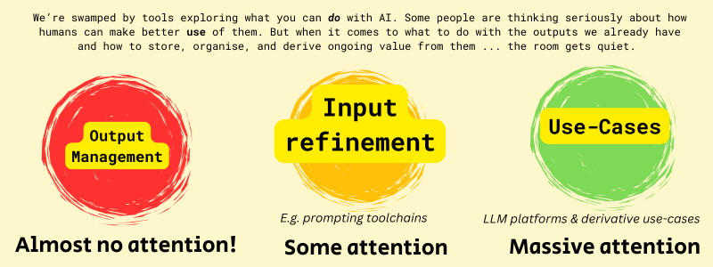
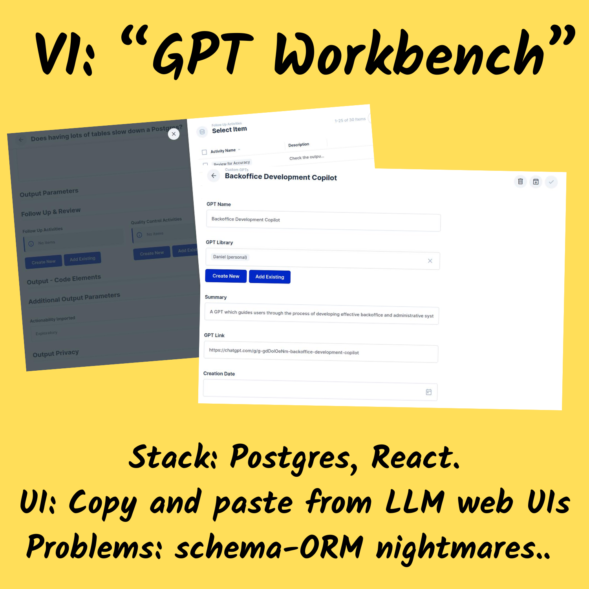
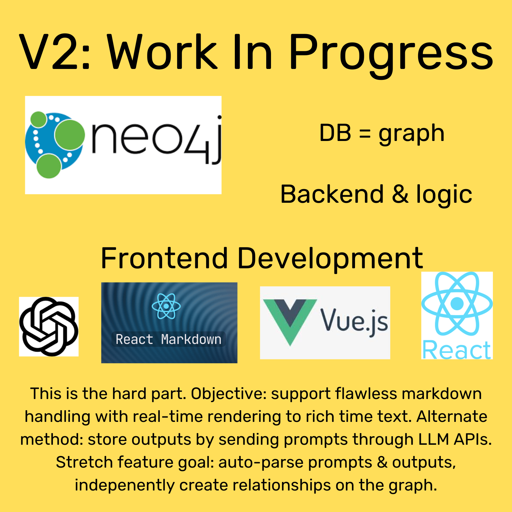

# Tapping Large Language Models' Vast Potential in Knowledge Generation

## Why I'm Working on This Passion Project

*By: Daniel Rosehill*  
*Oct 31st, 2024*

Since the early summer of 2024, I've been working on a system (for personal use) for creating an optimized workflow for generating and organizing knowledge "derived" from AI tools.

To many, the idea of describing the outputs of AI as "knowledge" seems paradoxical or even laughable. My perspective is different, and like all instances in which my thinking differs from con vention, I feel more encouraged to share it, if for no other reason than to widen the pool of perspectives on this important topic.

Here's the gist of my counter-argument to AI and LLM skeptics:

---

## Can AI-Derived Information Be Considered 'Knowledge'?

*All* information, whether it originates from humans or computers, can be treated as suspicious.

One man's knowledge is another's wild conspiracy theory — and another's unvalidated opinion. We each curate what we regard to be our own collection of "knowledge," and we each own our own version of truth. Like fingerprints, no two are identical. To suggest that LLMs are rupturing a pristine and objective set of thinking is, firstly, mistaken.

We may be able to point to objective flaws in the types of information that large language models (LLMs) generate. Challenges like hallucinations and shallow contextual understanding are well-known and widely discussed. These are also challenges that are actively being explored and mitigated by technologies like RAG.

### While Flawed, LLMs Outputs Are Far From Useless

However, to dismiss the utility of robust LLMs in helping to mine and explore human understanding is like saying that we should stop funding public libraries because some of the books they contain are evidently hogwash or contain outdated or erroneous science. Or that we should abandon using search engines like Google because much of the information they retrieve is non-useful and inaccurate affiliate marketing.

My heartfelt belief is that everyone who champions freedom of expression and believes in the wonderful potential that arises when information collaborates on sharing ideas should celebrate the advent of LLMs. If growing up through the advent of dial-up internet and working in the knowledge economy qualifies me to call myself a "digital native," I think LLMs are the greatest advent for digital natives since powerful computing and connectivity both became ubiquitous.

My interest in exploring how humans and LLMs can *collaborate* in mapping knowledge emanates from these foundational beliefs.

Inspired by the workings of the human mind, LLMs offer — to anybody who can pay a subscription or host one — an incredibly powerful mechanism for retrieving and synthesizing information.

This does not mean that LLMs are immune from things like censorship and manipulation that reflect not technical challenges but the intention of humans. They are not. And I argue that the justifiable concern about AI ethics has led to mainstream LLMs being overly censored and reflecting a specific cultural bias that fails to understand regional variation in culture. Although grounded in noble attempts to prevent LLMs from causing harm, I think these are mistakes.

But to point solely to the deficiencies of any emerging technology is to miss the huge opportunity they can bring in knowledge retrieval. And knowledge retrieval is arguably the order of the day. Being saturated in data is arguably just as useless as being deficient in it. Traditional search engines that rely on indexing emerging data struggle. LLMs present a very different and powerful new approach that is — at least — a worthy accompaniment to existing search tools.

---

## Why Capture and Organize LLM Outputs in the First Place, Though?

The modest knowledge-base project I am working on as a passion project "built in public" is simply an attempt to come up with a technical system that can play to the strengths of both AI tools and humans by providing a digitally robust system for capturing and mapping the various fundamental components of the LLM chains in use today (my definition of these is something like: prompts, outputs, model and agent configurations, and contextual data — the latter includes vectorized knowledge stores and RAG systems).

My focus since I began working on this has been on capturing LLM outputs at scale — and I began building this solely because output capture has been neglected in virtually all major LLMs. Like many passion projects, it began with failing to find a solution among current technologies that seemed to fit intuitively with my needs.

---

### Why Does Output Management Get So Little Love From AI Vendors?

The relative paucity of tools to store LLM outputs felt — and to me still does — like an enormous pity.

Capturing text digitally in the year 2024 is trivially easy: millions of outputs can be stored in a markdown archive that barely touches 100 MB. Tools for taking notes, reading notes, and mapping connections as graphs also abound.

Although no real technical constraints prevent them from doing so, mainstream LLM platforms (ChatGPT, Claude, et al.) have paid almost no attention to facilitating functional systems that allow users to retain and organize the data they receive back from LLMs (collectively, outputs).

My motivations for developing my own system for doing precisely this were twofold:

- Firstly, to enable the use of LLM outputs as a sort of "first entry" notepad to elucidate directions for further research and inquiry. Given the low cost of digital text storage mentioned earlier, I felt that being digitally selective in storage was not worth the time which such filtering would take.
- Secondly, to develop my own knowledge repository, albeit one derived from AI. As human-authored components of the LLM chain, I believe that it makes sense to capture prompts and outputs separately and that both provide independent value as data sources. Prompts provide an imprint of the users' questions and thoughts, while outputs provide the raw data supplied back by LLMs.

The simple use-case I've facilitated is having a personal notepad/wiki (which is far from revolutionary or imaginative!). But unlike a human-authored notepad, this has scaled at a pace that's rather quicker (some of my notes are saved at danielgoesprompting.com)! My enthusiasm for both exploring LLM use-cases and learning in general has facilitated rapid expansion.

As my personal AI-derived "vault" has scaled to thousands, I've chanced upon a secondary benefit of storing LLM outputs at scale that takes the project in more imaginative directions:

AI-derived knowledge vaults quickly become unwieldy and do not mesh well with traditional organization systems. Systems that require users to manually establish connections between nodes to visualize knowledge on a graph are suitable for small use-cases but quickly become impractical with scale.

But as much as this presents a challenge, I believe it presents an opportunity.

If the main benefit of using LLMs is to assist with finding "directions" in research avenues rather than retrieving 100% accurate information, tracking these relationships — between prompts, outputs, and follow-ups — can be more valuable than the face value of the information. Or at least, they both offer independent utility.

---

## Secondary Benefits That Derive from Organized Prompt and Output Storage in Information Systems

With that in mind, as my project has evolved, I've begun thinking about a few specific additional directions:

- How an AI middleware layer could be used to autonomously establish the relationships between stored outputs, helping users make sense of the growing collection of AI-generated knowledge as it grows. Practical use-cases in a collaborative knowledge-sharing environment might include allowing users to discover existing lines of inquiry into overlapping topics that have been conducted within the organization, potentially enabling collaborations that might not have otherwise occurred.
- Topic clustering can help make sense of the evolution of the individual or organization’s research as it evolves, reshapes, and grows. This can be visualized.
- "AI on top of AI." It's becoming increasingly common for KMs and wikis to offer "AI on top of AI." Systems like RAG can use the AI-generated knowledge repository as a basis for mining previously retrieved information. This can take the form of interactive chatbots that are trained on the knowledge repository for enhanced discovery.
- LLMs are fast evolving. By collecting outputs, one builds up a repository of data that could later be mined to determine insights about the evolution of LLM models themselves. Once prompts and outputs are properly related and saved in this system, this data could be used to determine how LLM response patterns are shifting over time, which use-cases are becoming more feasible as capabilities evolve, and which prompting strategies need refining and adjustments.

These and many other features can be enabled by robust output management and storage.

---

## ThoughtNet Stack - V1

*Summer to Sep 24*

### Components

- PostgreSQL (Supabase)
- ChatGPT web UI
- React frontend (Laravel Nova)

Proof of concept achieved but ... lots of data relationships = cumbersome frontend building process and poor database performance.

---

## "ThoughtNet" Stack - V2

A pivoted stack intended to provide more intuitive support for a graph database backend to support native handling of relationships.

- Graph database
- Backend logic
- Frontend: markdown handling and LLM API integrations

### Hoped-for features

- A perfectly functional system for storing LLM outputs directly in a graph database
- Great markdown handling to leverage the best features of tools like Obsidian and take advantage of LLMs' affinity for working with markdown
- Recall previous outputs and context snippets on subsequent prompts
- Recall of prompts and outputs
- Features to support discovery of related outputs
- Features to support topic cluster discovery and trends over time (topics fading in and out of interest, thought processes evolving)
- Visualisation of KM system as a growing graph

## Author

Daniel Rosehill  
(public at danielrosehill dot com)

## Licensing

This repository is licensed under CC-BY-4.0 (Attribution 4.0 International)  
[License](https://creativecommons.org/licenses/by/4.0/)

### Summary of the License
The Creative Commons Attribution 4.0 International (CC BY 4.0) license allows others to:
- **Share**: Copy and redistribute the material in any medium or format.
- **Adapt**: Remix, transform, and build upon the material for any purpose, even commercially.

The licensor cannot revoke these freedoms as long as you follow the license terms.

#### License Terms
- **Attribution**: You must give appropriate credit, provide a link to the license, and indicate if changes were made. You may do so in any reasonable manner, but not in any way that suggests the licensor endorses you or your use.
- **No additional restrictions**: You may not apply legal terms or technological measures that legally restrict others from doing anything the license permits.

For the full legal code, please visit the [Creative Commons website](https://creativecommons.org/licenses/by/4.0/legalcode).